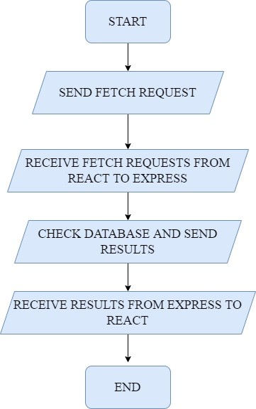
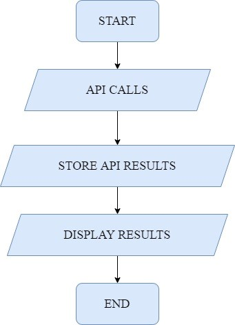
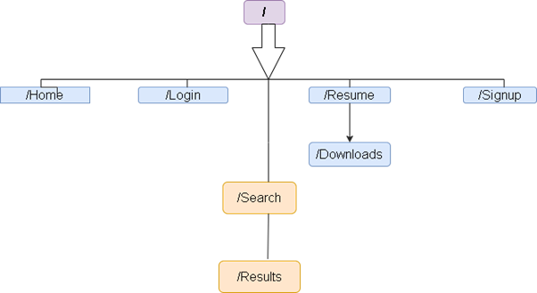
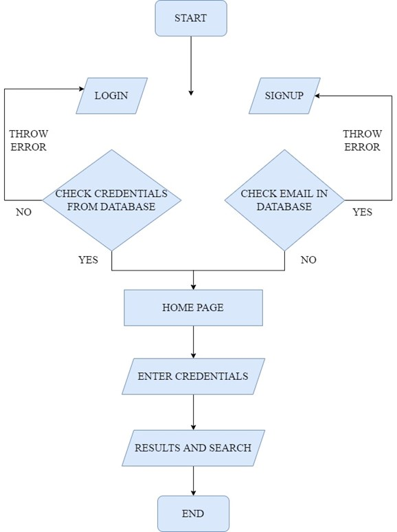
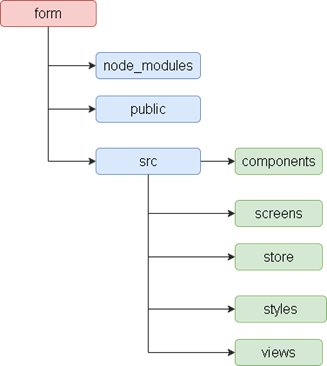

# Resume Builder and Job Search
Many Resume creating apps and many job search apps exist independently, but there is seldom a free version where both tasks can be achieved simultaneously. This project allows users to log in to the website and then enter their details in order to generate a Resume in case they do not have one. In the case when the users do have a Resume, they can make use of the Job Search functionality which allows users to search for jobs by name, type, place, salary, technologies, companies, etc and consolidates and displays them in a neat manner. 
The user can click on the jobs and navigate to the job posting which will redirect them to the job. But the idea is that they can create their resume and search for jobs in one place. This project will allow the person to apply for a job in the company they are interested in for the vacancy which would be available at the company using the resume created on this website.

<bold> Fig. Database Operations</bold>

<bold> Fig. API Request and Response</bold>

<bold> Fig. Website Endoints</bold>

<bold> Fig. System Data Flow</bold>

<bold> Fig. Web Page Structure</bold>

